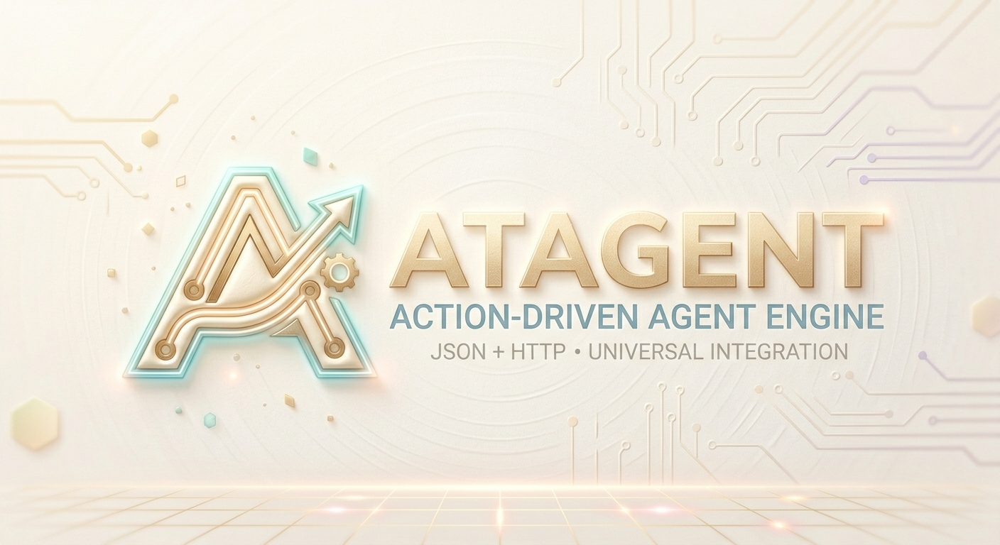
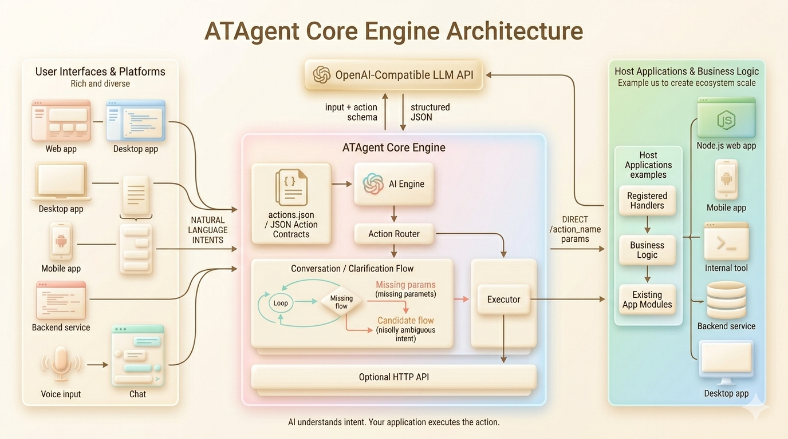

# ATAgent



Lightweight Agent engine

> A lightweight engine that lets AI control any application

---

## 1. What is this?

ATAgent is a **lightweight Agent engine** that helps developers quickly add natural language control capabilities to their applications.

**Core idea**: Developers define what their application can do using a single JSON file (actions, parameters, permissions, execution conditions). ATAgent calls an AI model to understand the user's natural language input, matches the right action within the defined structure, extracts the required parameters, and invokes the corresponding business function. Developers define "what can be done" — AI understands "what the user wants to do."

```text
User says: "Add a reminder for tomorrow's meeting"

ATAgent flow:
  1. Send user input + action definitions to AI
  2. AI understands intent → matches add_todo from defined actions
  3. AI extracts parameters → content = "tomorrow's meeting"
  4. Execute business function → done

User says something ambiguous:

  1. AI identifies multiple candidates → list them for the user to choose
  2. AI determines intent is unclear → proactively asks for clarification
```

**Key features**:
- **AI semantic understanding**: Users can express themselves naturally in any way; action definitions, parameter structures, permissions, and execution conditions are explicitly defined by the developer in JSON — AI operates within this structure.
- **Pure configuration-driven**: All actions are defined in a JSON file.
- **Plug and play**: Copy the ATAgent folder into your project. No package manager required.
- **engine agnostic**: Embeds into web, desktop, backend, or any other environment.
- **Fully custom UI**: The AI interaction interface (buttons, dialogs, etc.) is designed entirely by the developer. ATAgent only provides the API.
- **Visual configuration**: Built-in configuration UI for managing actions and AI settings — ready to use out of the box during development.
- **Voice input support**: Developers can integrate any speech recognition solution and pass the resulting text into the engine, enabling a complete voice-controlled experience.

---

## 2. Use Cases

| | Scenario | Notes |
|---|---|---|
| ✅ | Private deployment / internal tools | Compatible with self-hosted models (e.g. Ollama) |
| ✅ | Applications with a well-defined action set | Recommended: ≤ 5000 actions |
| ✅ | Complex natural language understanding | Semantic understanding is handled by AI, covering any phrasing |
| ✅ | Multi-language input | AI natively supports multiple languages, no extra adaptation needed |
| ✅ | Workflow orchestration | Supports dependencies and sequential execution across actions |
| ✅ | Voice-controlled interfaces | Plug in any speech-to-text solution and the full interaction flow works |

---

## 3. Architecture



ATAgent is embedded into the developer's project as a **folder**:

```
atagent/
├── core/                    # Core logic
│   ├── ai.js                # AI semantic engine (calls LLM API)
│   ├── executor.js          # Action executor
│   ├── loader.js            # Loads JSON config
│   ├── conversation.js      # Multi-turn conversation state management
│   └── server.js            # Built-in HTTP server (optional)
├── ui/                      # Visual configuration interface
│   ├── index.html
│   ├── app.js
│   └── style.css
├── config/                  # Config storage
│   └── actions.json         # Action definitions (core config)
├── index.js                 # Main entry point
└── README.md
```

- **config/actions.json**: The single file where developers define all actions, parameters, permissions, and execution conditions.
- **core/ai.js**: Wraps the LLM API call — handles semantic understanding, action matching, and parameter extraction within the defined action structure.
- **core/**: Remaining modules handle action dispatch, config loading, and multi-turn conversation management.
- **ui/**: Visual configuration interface for action management and AI settings.
- **index.js**: Exports the ATAgent class for use in your project.

---

## 4. AI Configuration

ATAgent requires a configured LLM API to function. It supports any service compatible with the OpenAI API format, including self-hosted models.

### 4.1 Via the visual interface (recommended)

Visit `http://localhost:3000/atagent` and click the **"AI Settings"** button in the top right. Fill in the following:

| Parameter | Description | Example |
|-----------|-------------|---------|
| API Base URL | LLM service endpoint | `https://api.openai.com/v1` |
| API Key | Authentication key | `sk-xxxxxx` |
| Model | Model name to use | `gpt-4o`, `qwen-max`, `deepseek-chat` |
| Max Tokens | Max tokens per call | `1024` |

Changes take effect immediately — no restart required.

### 4.2 Via code

```javascript
const agent = new ATAgent({
  configPath: './atagent/config/actions.json',
  ai: {
    baseURL: 'https://api.openai.com/v1',
    apiKey: process.env.ATAGENT_API_KEY,
    model: 'gpt-4o',
    maxTokens: 1024
  }
});
```

### 4.3 Self-hosted models

Replace `baseURL` with your local service address to use Ollama or similar:

```javascript
ai: {
  baseURL: 'http://localhost:11434/v1',
  apiKey: 'ollama',   // local deployments typically don't require a real key
  model: 'llama3'
}
```

---

## 5. Action Definition Format (JSON)

Developers define the full action structure in `config/actions.json`. This is the core of the engine — AI understanding and execution both operate within this structure:

```json
{
  "version": "1.0",
  "actions": [
    {
      "name": "add_todo",
      "description": "Add a new to-do item",
      "parameters": [
        {
          "name": "content",
          "type": "string",
          "description": "The content of the to-do",
          "required": true
        },
        {
          "name": "due_date",
          "type": "string",
          "description": "Due date (optional)",
          "required": false
        }
      ],
      "examples": [
        "Add a to-do: team meeting tomorrow",
        "Remind me to write the weekly report",
        "Create a task: buy milk"
      ],
      "messages": {
        "success": "To-do \"{content}\" added",
        "confirm": "Confirm adding to-do \"{content}\"?"
      },
      "permission": "normal",
      "enabled": true,
      "tags": ["productivity"]
    },
    {
      "name": "navigate",
      "description": "Navigate to a specific page within the application",
      "parameters": [
        {
          "name": "page",
          "type": "string",
          "description": "Target page name",
          "required": true
        }
      ],
      "examples": [
        "Go to settings",
        "Open my profile",
        "Take me to the home page"
      ],
      "permission": "normal",
      "enabled": true,
      "tags": ["navigation"]
    }
  ]
}
```

**Field reference**:

| Field | Type | Required | Description |
|-------|------|----------|-------------|
| `name` | string | ✅ | Unique action identifier, used for handler mapping in code |
| `description` | string | ✅ | Describes what the action does — AI uses this to understand its purpose |
| `parameters` | array | ⭕ | Parameter structure definition — AI extracts values from user input |
| `examples` | array | ✅ | Example phrases — helps AI recognize trigger scenarios. More is better. |
| `messages` | object | ⭕ | Message templates that override the engine's default prompts |
| `permission` | string | ⭕ | Permission level: `normal` / `confirm` / `admin` |
| `enabled` | boolean | ⭕ | Whether the action is active. Default: `true` |
| `tags` | array | ⭕ | Category tags used to pre-filter the candidate set by context, reducing the number of actions sent to AI per call |
| `cache` | object | ⭕ | Explicit success-result cache settings. Disabled by default. |
| `workflow` | object | ⭕ | Sequential workflow definition. Each step can reference root params, context, and previous step results. |

> **On the `version` field**: Identifies the config file format version. Used by the engine during hot-reload to handle in-progress sessions and prevent state corruption.

### 5.1 Advanced action fields

**Tag pre-filtering**

Pass `context.tags` when executing. ATAgent first narrows the candidate set by overlapping action tags, and automatically falls back to the full action list if nothing matches.

```javascript
await agent.execute("Open settings", {
  context: {
    tags: ["navigation"]
  }
});
```

**Explicit cache**

Caching is opt-in and only stores `success` responses.

```json
{
  "name": "fetch_summary",
  "cache": {
    "ttlMs": 60000,
    "contextKeys": ["userId"]
  }
}
```

- `ttlMs`: cache lifetime in milliseconds
- `contextKeys`: optional context fields included in the cache key

**Sequential workflow**

Workflow actions execute `steps` in order. Step params support `{{...}}` references to:

- `params.<name>` for root action params
- `context.<name>` for request context
- `steps.<stepId>.data.<field>` for previous step results

```json
{
  "name": "prepare_report",
  "workflow": {
    "steps": [
      {
        "id": "draft",
        "action": "create_draft",
        "params": {
          "title": "{{params.title}}"
        }
      },
      {
        "id": "publish",
        "action": "publish_draft",
        "params": {
          "draftId": "{{steps.draft.data.id}}",
          "note": "publish {{params.title}}"
        }
      }
    ]
  }
}
```

--- 

## 6. AI Semantic Understanding

ATAgent sends the user's input together with the developer-defined action structure to the LLM. The AI then:

1. **Intent recognition**: Understands what the user wants to do and finds the best matching action from the defined set.
2. **Parameter extraction**: Pulls the required parameter values from the natural language input, following the parameter structure definition.
3. **Ambiguity detection**: Determines whether multiple actions are plausible candidates, or whether the intent is unclear.
4. **Clarification generation**: When required parameters are missing, generates a natural follow-up question.

### 6.1 Three-tier handling logic

```text
User input + action structure → AI analysis
    │
    ├─ High-confidence match ─────────────→ Execute directly
    │
    ├─ Multiple plausible candidates ─────→ List options for user to choose
    │    "Did you mean: ① Add to-do  ② Add calendar event  ③ Send message?"
    │
    ├─ Unclear intent ────────────────────→ AI asks for clarification
    │    "I'm not sure what you'd like to do — could you be more specific?"
    │
    └─ User types a precise command ──────→ Skip AI, execute directly
         /add_todo team meeting tomorrow
```

### 6.2 User takeover

At any point, users can bypass AI matching by typing a command directly in `/action_name params` format:

```text
/add_todo product review meeting at 3pm tomorrow
/navigate settings
/delete_todo id=123
```

After two consecutive clarification rounds fail to resolve the intent, the engine automatically prompts the user with this option.

### 6.3 Clarification round limit

A maximum of 2 clarification rounds are attempted. After that, the engine responds with:

```text
"I'm still unable to understand your request. You can use /action_name to execute directly, e.g. /add_todo team meeting tomorrow"
```

---

## 7. Integration (Developer Guide)

### 7.1 Copy the folder into your project

Place the `atagent` folder in your project root directory.

### 7.2 Initialize and register handlers

```javascript
const ATAgent = require('./atagent');

const agent = new ATAgent({
  configPath: './atagent/config/actions.json',
  ai: {
    baseURL: 'https://api.openai.com/v1',
    apiKey: process.env.ATAGENT_API_KEY,
    model: 'gpt-4o'
  },
  maxClarifyRounds: 2,
  maxCandidates: 3
});

agent.registerHandlers({
  add_todo: async (params) => {
    await yourApp.todo.add(params.content, params.due_date);
    return { message: `To-do "${params.content}" added` };
  },
  navigate: async (params) => {
    yourApp.router.push(`/${params.page}`);
    return { message: `Navigated to ${params.page}` };
  }
});

// Web app: mount as middleware
app.use('/atagent', agent.middleware());

// Desktop / backend: start built-in HTTP server
agent.startServer(3001);
```

### 7.3 Frontend integration

```javascript
const response = await fetch('/atagent/api/execute', {
  method: 'POST',
  headers: { 'Content-Type': 'application/json' },
  body: JSON.stringify({
    input: "Add a to-do: team meeting tomorrow",
    context: { route: "/todos", userId: "123" },   // optional context
    sessionId: "user-123-session"                  // for multi-turn conversations
  })
});

const result = await response.json();

switch (result.status) {
  case 'success':
    showToast(result.message);
    break;
  case 'needs_more_info':
    showPrompt(result.question);
    break;
  case 'multiple_candidates':
    showCandidateSelector(result.candidates);
    break;
  case 'requires_confirmation':
    showConfirmDialog(result.message, result.confirmToken);
    break;
  case 'unresolved':
    showToast(result.message);
    break;
}
```

**Response format**:

```json
// Success
{
  "status": "success",
  "message": "To-do \"team meeting tomorrow\" added",
  "data": { "todoId": 456 }
}

// Missing required parameters
{
  "status": "needs_more_info",
  "action": "add_todo",
  "missing_params": ["content"],
  "question": "What should the to-do say?",
  "clarifyRound": 1,
  "sessionId": "user-123-session"
}

// Ambiguous intent
{
  "status": "multiple_candidates",
  "candidates": [
    { "name": "add_todo",  "description": "Add a to-do item",      "score": 0.92 },
    { "name": "add_event", "description": "Add a calendar event",  "score": 0.85 }
  ],
  "message": "Did you mean: ① Add a to-do item  ② Add a calendar event?"
}

// Clarification limit reached
{
  "status": "unresolved",
  "message": "I'm still unable to understand your request. You can use /action_name to execute directly, e.g. /add_todo team meeting tomorrow"
}
```

### 7.4 Multi-turn conversations

Session state is identified by `sessionId`. The engine uses in-memory storage by default.

For a zero-dependency persistence option, you can use the built-in JSON file stores:

```javascript
const ATAgent = require('./atagent');

const agent = new ATAgent({
  sessionStore: new ATAgent.JsonFileStateStore('./data/sessions.json'),
  confirmationStore: new ATAgent.JsonFileStateStore('./data/confirmations.json'),
  cacheStore: new ATAgent.JsonFileCacheStore('./data/cache.json')
});
```

If you already use Redis, MySQL, PostgreSQL, or your own application database, inject a custom store instead. The engine does not depend on any specific storage backend; it only expects a minimal interface:

```javascript
const stateStore = {
  async get(key) {},
  async set(key, value) {},
  async delete(key) {}
};

const cacheStore = {
  async get(key) {},
  async set(key, value, ttlMs) {},
  async delete(key) {}
};

const agent = new ATAgent({
  sessionStore: stateStore,
  confirmationStore: stateStore,
  cacheStore
});
```

- `sessionStore` / `confirmationStore`: persistence for clarification sessions and confirmation tokens
- `cacheStore`: persistence for successful action result caching
- The default remains in-memory. JSON, Redis, or database storage is only enabled when you pass a custom store explicitly.

```text
User:  "Add a to-do"
AI:    "What should the to-do say?"  (needs_more_info, clarifyRound: 1)
User:  "Team meeting tomorrow"
AI:    Executes the action, returns success
```

### 7.5 Direct invocation (non-web environments)

```javascript
const result = await agent.execute('Add a to-do', {
  context: { userId: 'cli-user' },
  sessionId: 'cli-session'
});

if (result.status === 'needs_more_info') {
  const userInput = await askUser(result.question);
  const finalResult = await agent.continue(userInput, result.sessionId);
  console.log(finalResult.message);
}
```

---

## 8. Prompts and Messages

The engine ships with sensible default prompts. Developers can override them globally or per action:

**Global override (at initialization)**:
```javascript
const agent = new ATAgent({
  messages: {
    unresolved:      "I'm still not sure — try /action_name for precise control",
    askClarify:      "Could you be more specific?",
    candidatePrompt: "Which of the following did you mean?"
  }
});
```

**Per-action override (in `actions.json` via the `messages` field)**:
```json
"messages": {
  "success": "To-do \"{content}\" added",
  "confirm": "Confirm adding to-do \"{content}\"?"
}
```

---

## 9. Permissions and Confirmation

| Level | Behavior | Typical use cases |
|-------|----------|-------------------|
| `normal` | Execute immediately | Queries, browsing, creating |
| `confirm` | Requires user confirmation before executing | Deleting, sending, payments |
| `admin` | Requires admin privileges | System settings, permission changes |

---

## 10. Context and Pre-execution Checks

`canExecute` is a critical safety mechanism for production. It is recommended for all actions that modify state:

```javascript
agent.registerHandlers({
  delete_todo: {
    handler: async (params) => { /* deletion logic */ },
    canExecute: ({ context }) => {
      if (!context.selectedTodoId) {
        return {
          allowed: false,
          reason: 'Please select a to-do item first',
          suggestedAction: { label: 'Select to-do', action: 'select-todo' }
        };
      }
      return { allowed: true };
    }
  }
});
```

---

## 11. Visual Configuration Interface

ATAgent includes a built-in web configuration UI (the `ui/` directory). Access it at `http://localhost:3000/atagent`.

**Features**:
- **Action management**: View, add, edit, and delete actions. Changes are written directly to `config/actions.json`.
- **AI settings**: Configure API Base URL, API Key, model name, and other parameters. Changes take effect immediately.
- **Action testing**: Enter natural language and see AI matching results and execution output in real time.
- **Config export / import**: Import and export JSON config files for team collaboration and backup.

> In production, this interface should be disabled or protected with authentication to avoid exposing sensitive configuration such as API keys.

---

## 12. Config Version Management

The top-level `version` field in `actions.json` manages configuration changes:

- **Hot reload**: The engine reloads config automatically without a restart.
- **Session protection**: During hot reload, in-progress multi-turn conversation sessions are handled with compatibility checks.
- **Breaking changes** (e.g. removing an action, changing a required parameter) are automatically treated as a new version. Active sessions receive a friendly message and are gracefully closed.

---

## 13. Performance

| Metric | Target | Notes |
|--------|--------|-------|
| End-to-end response time | < 2s | Includes AI API call under good network conditions |
| Local processing time | < 10ms | Local logic only, excluding AI API call |
| Memory usage | < 20MB | Includes all action configs and runtime state |
| Max recommended actions | 5000 | Above this, use `tags`-based routing to reduce actions sent per AI call |

**Performance tips**:
- Use `tags` to pre-filter the candidate set by context, reducing the number of actions sent to AI and lowering both latency and token cost.
- Cache results for high-frequency actions — identical inputs can return cached responses directly.
- Use faster models (e.g. GPT-4o mini, Qwen-Turbo) to balance quality and response time.

---

## 14. Quick Start

**14.1 Copy the folder**: Place the ATAgent folder into your project.

**14.2 Configure AI**: Visit `/atagent` and click "AI Settings" to fill in your API parameters, or pass the `ai` config object at initialization.

**14.3 Define actions**: Edit `atagent/config/actions.json` and define your application's action structure. More `examples` = better AI matching accuracy.

**14.4 Register handlers**: Import ATAgent in your project entry point and register a business function for each action.

**14.5 Build your AI interface**: Add an AI button or dialog to your app, call `/atagent/api/execute`, and handle the five response statuses.

**14.6 Start your project**: Launch your application — ATAgent initializes automatically and is ready to use.

---

## 15. Summary

ATAgent gives any application natural language control capabilities with **a single folder and a single JSON config file**. Core design principles:

- **Developers define the structure, AI understands the intent**: Actions, parameters, permissions, and execution conditions are explicitly defined by the developer. AI operates within this structure to interpret user intent and extract parameters — clear separation of responsibilities.
- **Clarify rather than fail silently**: When intent is uncertain, the engine asks — users always know what's happening.
- **Users can always take control**: The `/action_name params` format is available as a fallback in every scenario.
- **The engine provides the API — UI and prompts belong to the developer**: Sensible defaults ship out of the box, fully overridable when needed.
- **Security first**: Permission levels + `canExecute` pre-execution checks protect sensitive operations in production.

---

**License**: MIT © ATAgent Contributors
